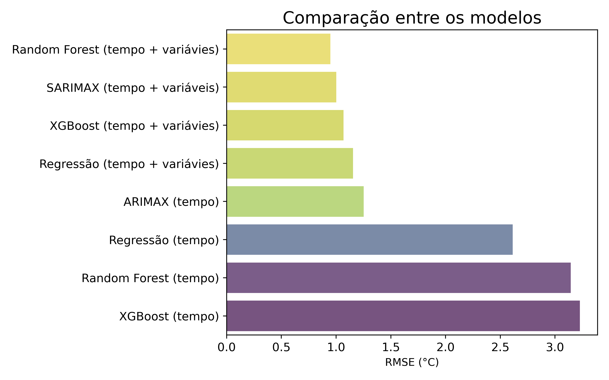
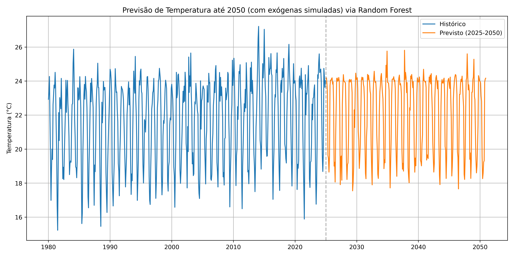
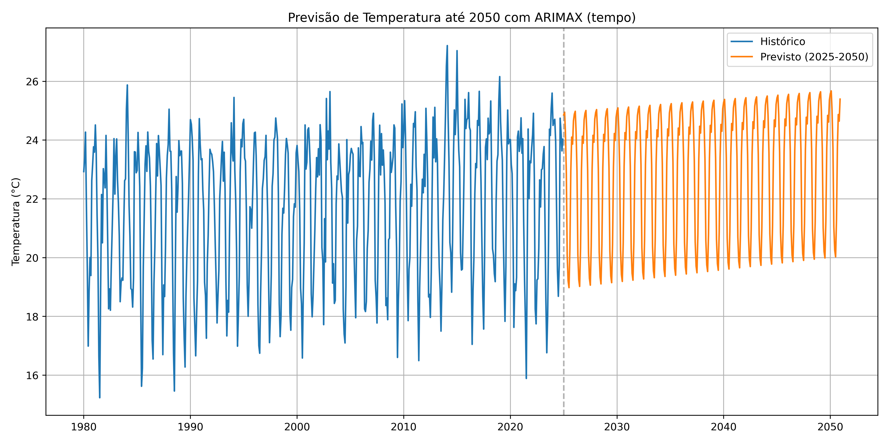
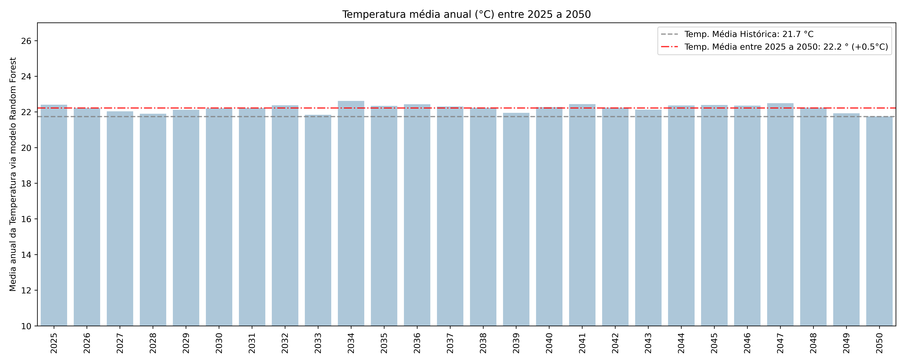

# forecast-temperatura-era5

# 🌡️ **Modelagem preditiva da temperatura média com Machine Learning e Séries Temporais**
Este projeto usa dados de reanálise climática do [ERA5](https://cds.climate.copernicus.eu/datasets/reanalysis-era5-single-levels?tab=overview) para prever a temperatura mensal média de 2025 a 2050, utilizando modelos como Regressão Linear, Random Forest, XGBoost, ARIMAX e SARIMAX.

---

## 📄 Objetivo:
Criar uma pipeline preditiva robusta com simulaçõs Monte Carlo para projetar a temperatura média mensal futura até 2050 em uma região de interesse, avaliando cenários com e sem o uso de variávies exógenas.

---

## 📉 Modelos utilizados:
- Regressão Linear (com e sem variáveis exógenas)
- Random Forest (com e sem variáveis exógenas)
- XGBoost (com e sem variáveis exógenas)
- ARIMAX
- SARIMAX com variáveis exógenas
- Simulações Monte Carlo para projeção de cenários futuros

---

## 📦 Bibliotecas
- `pandas`, `numpy`, `matplotlib`, `seaborn`
- `scikit-learn`, `xgboost`
- `statsmodels`

---

## 📊 Resultados
- Comparação de desempenho entre os modelos

- Previsão da temperatura média mensal de 2025 a 2050 com Random Forest (com variáveis exógenas)

- Previsão da temperatura média mensal de 2025 a 2050 com ARIMAX

- Gráfico de barras com a temperatura média anual de 2025 a 2050 e representação da diferença entre a temperatura média anual futura e a temperatura média histórica

---

##  📁 Organização
- `notebooks/` - notebook principal com toda a análise
- `data/` - dados brutos utilizados na modelagem
- `outputs/` - graficos gerados a partir das análises e simulações
- `README.md` - este arquivo
- `.gitignore` - lista de arquivos que devem ser ignorados pelo Git

---

## 📌 Observação
Os dados utilizados são públicos, provenientes do ERA5 (Copernicus Climate Data Store), e foram processados localmente antes de serem versionados neste repositório.
